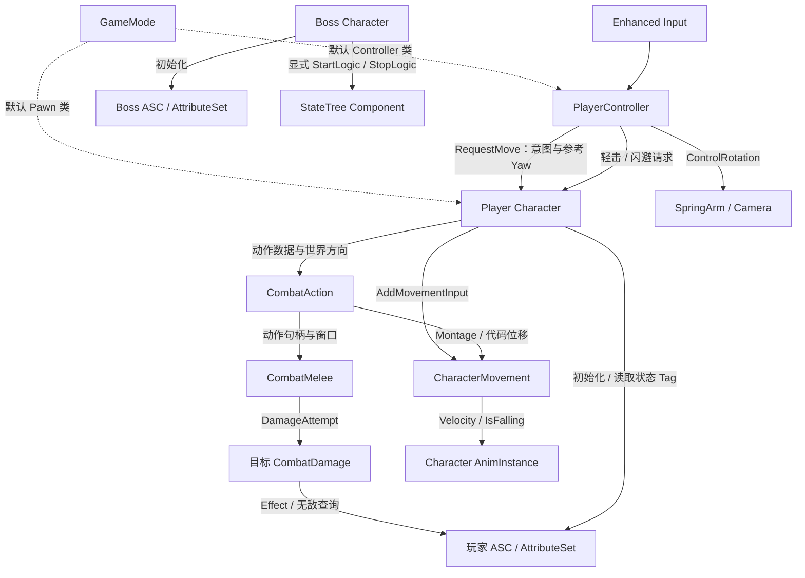

# AshenOath 架构总览

AshenOath 是单人第三人称 Boss 战项目。`AshenOath` 游戏模块组装输入、角色、GAS 和 UI；`AshenOathCombat` 提供不依赖具体玩家/Boss 类型的动作、近战扫掠与目标侧伤害组件。

## 当前结构

虚线表示默认类配置，实线表示运行时调用或数据传递；对象所有权见下表。

| 对象 | 持有或管理的内容 | 边界 |
|---|---|---|
| GameMode | 默认 Pawn/Controller 类选择 | 原生类提供默认值，蓝图子类配置资源；当前无局内流程协调 |
| PlayerController | 自身 InputComponent 的绑定、本地 Mapping Context 注册记录、最近移动意图 | 每次输入取当前 Pawn；只把闪避意图交给 Character，不实现位移积分或修改属性 |
| Player Character | ASC、AttributeSet、镜头和 Combat 组件；使用继承的 CharacterMovement | 验证角色状态、选择玩家动作数据，将相对视角意图转为世界方向；不直接写战斗数值 |
| Boss Character | ASC、AttributeSet、StateTreeComponent | 协调初始化和退出顺序；尚不承担实际选招 |
| AttributeSet | Health、MaxHealth、Stamina、MaxStamina | 维护数值范围；Health 归零目前不会自动生成死亡状态 |
| CombatAction | 当前动作/Montage、一次性 Cost、代码位移、动作窗口与延迟恢复 | 运行状态绑定唯一动作句柄；中断、死亡和退出走同一清理路径 |
| CombatMelee | 动作伤害快照、武器扫掠、Notify 窗口和窗口内去重 | 不决定动作或应用 Effect；向目标提交中立伤害尝试 |
| CombatDamage | 目标侧伤害入口和无敌判定 | 区分闪避无敌与其他无敌，通过源/目标 ASC 应用伤害 Effect |
| AnimInstance | 本实例的移动表现数据；对 Character/Movement 的弱引用缓存 | 读取实际移动结果，不拥有 Gameplay 动作状态 |

角色组件由构造函数创建。ASC 和 AttributeSet 随 Character 存续；动画缓存与输入注册记录使用弱引用，不延长所引用对象的生命周期。

## 两条关键运行路径

**移动到动画**：Move Input → Controller 转发意图与参考 Yaw → Character 验证约束并转换方向 → CharacterMovement 执行移动 → AnimInstance 读取实际速度。

**闪避到清理**：Dodge Input → Character 选择前/后翻并冻结世界方向 → CombatAction 验证 Cost 后启动 Montage → CharacterMovement 扫掠位移、ASC 持有窗口 Tag → 动作结束/中断/死亡统一移除窗口、恢复移动模式；最后一次成功消耗后延迟启用 GAS 耐力恢复 Effect。详见 [战斗动作与伤害](systems/combat-actions.md)。

**初始化到退出**：玩家随占有刷新 GAS 上下文；Boss 在进入游戏时初始化 GAS，再调用 StateTree 启动。Boss 退出先停树，再清理 GAS 上下文，使树的退出逻辑仍可使用 GAS。
