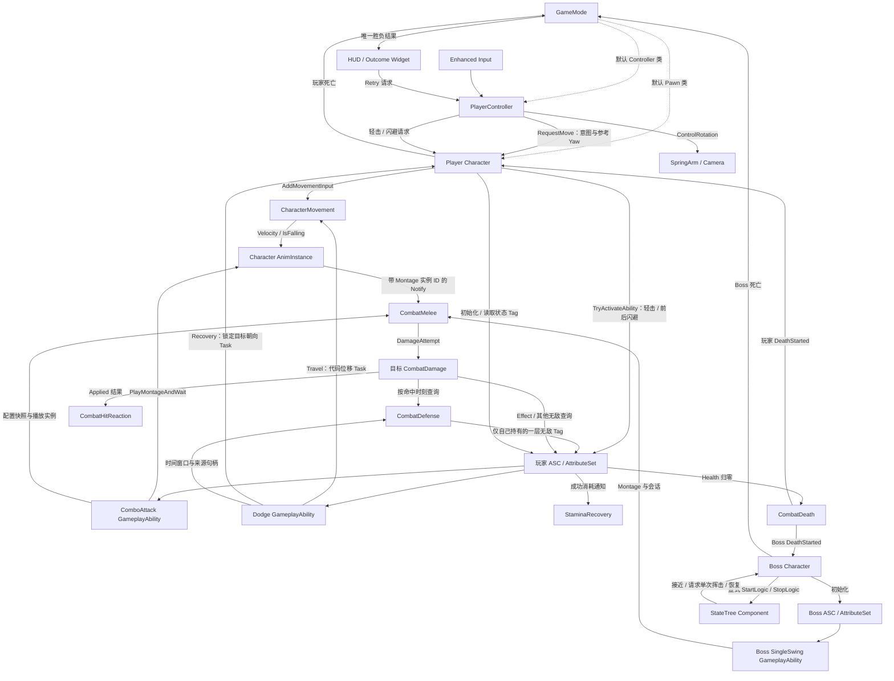

# AshenOath 架构总览

AshenOath 是单人第三人称 Boss 战项目。`AshenOath` 游戏模块组装输入、角色、GAS、胜负和 UI；`AshenOathCombat` 提供不依赖具体玩家/Boss 类型的动作、近战扫掠、目标侧伤害、受击和死亡组件。

## 当前结构

虚线表示默认类配置，实线表示运行时调用或数据传递；对象所有权见下表。

| 对象 | 持有或管理的内容 | 边界 |
|---|---|---|
| GameMode | 默认 Pawn/Controller 类、当前 Boss 和一次性胜负结果 | 首个有效死亡报告决定胜负；只在结算后接受重试并重新加载当前关卡 |
| PlayerController | InputComponent 绑定、Mapping Context 注册、最近移动意图和重试转发 | 每次输入取当前 Pawn；结算时关闭 Gameplay 输入并切换到 UI，不自行决定胜负 |
| Player Character | ASC、AttributeSet、镜头和 Combat 组件；使用继承的 CharacterMovement | 验证角色状态、选择玩家动作数据，将相对视角意图转为世界方向；不直接写战斗数值 |
| Boss Character | ASC、AttributeSet、StateTreeComponent、单次挥击 AbilitySpec | 协调初始化和退出顺序；向 StateTree 提供请求、取消和对应 Ability 结束通知，不播放动画或执行选招评分 |
| AttributeSet | Health、MaxHealth、Stamina、MaxStamina | 只维护数值范围；Death 组件观察 Health 并拥有终止转换 |
| Combat GameplayAbility 基类 | 动作互斥、ActionData Cost 检查/应用与成功消耗通知 | 只共享 GAS 事务，不编排具体攻击或闪避 |
| MeleeAttack GameplayAbility 基类 | 玩家近战共用的 Montage Task、Cost 提交、动画来源身份、Melee 会话和清理 | 不决定具体输入语义、连招规则或蓄力阶段；结束、中断、失败统一经 `EndAbility` 释放会话 |
| ComboAttack GameplayAbility | 轻击连招激活、Combo Window 输入消费及 Montage Section 推进 | 直接作为轻击 Ability 授予；只有所属动画窗口接受的重复输入才能推进下一段 |
| HeavyAttack GameplayAbility | 按下、蓄力消耗、松开/满蓄释放及伤害倍率 | 与 Combo 并列复用 MeleeAttack 生命周期，不继承连招状态 |
| Dodge GameplayAbility | 一次闪避的方向/朝向策略快照、Montage、Cost、Travel/Recovery Task 与 Defense 窗口协调 | 前后配置由两个 AbilitySpec 的 SourceObject 区分；玩法状态只在费用成功后建立 |
| CombatMovement AbilityTask | 一次代码位移的时间进度、MovementMode 与 RootMotionMode 接管 | Sweep 受阻自然截断；完成、取消和失败均恢复接管状态 |
| DodgeFacingRecovery AbilityTask | 在闪避末段按实时目标方位把角色从位移朝向平滑带回锁定朝向 | 位于项目模块，只读取通用 Targeting 提供的目标 Actor；不进入 Combat 模块 |
| CombatDefense | 普通/完美闪避窗口、来源句柄和自己施加的 loose Tag | 完美窗口必须是普通窗口的真子集且一次闪避最多消费一次；死亡时可整体复位 |
| StaminaRecovery | 延迟计时器及自己施加的周期恢复 Effect | 跨越多次动作；只有成功消耗重启，死亡和退出停止 |
| CombatMelee | 伤害配置快照、播放来源身份、武器扫掠、Notify 窗口和窗口内去重 | 不查找当前 Ability；只接受所属 Mesh、AnimInstance、Montage 实例的信号并提交中立伤害尝试 |
| CombatDamage | 目标侧伤害入口、终止状态拒绝、无敌判定和结果广播 | 区分普通/完美闪避与其他无敌，通过源/目标 ASC 应用伤害 Effect |
| CombatHitReaction | 监听目标侧 Applied 结果，拥有短硬直 Tag、计时器和基础受击 Montage | 项目模块注入 Tag；终止状态不再启动受击，死亡可同步复位其状态 |
| CombatDeath | 观察注入的 Health 属性，拥有一次性 Dead Tag、死亡事件和基础 Montage | 先建立终止状态，再广播给宿主清理并播放死亡表现；不引用具体角色或 GameMode |
| HUD / Outcome Widget | 观察 GameMode 胜负并显示 Victory/Defeat 与 Retry | HUD 同步输入模式；Widget 只把按钮请求转发给 Controller |
| AnimInstance | 本实例的移动表现数据；对 Character/Movement 的弱引用缓存 | 读取实际移动结果，不拥有 Gameplay 动作状态 |

角色组件由构造函数创建。ASC 和 AttributeSet 随 Character 存续；动画缓存与输入注册记录使用弱引用，不延长所引用对象的生命周期。

## 两条关键运行路径

**移动到动画**：Move Input → Controller 转发意图与参考 Yaw → Character 验证约束并转换方向 → CharacterMovement 执行移动 → AnimInstance 读取实际速度。

**轻击到伤害**：Attack Input → Character 请求已授予的 ComboAttack Ability → MeleeAttack 基类确认 Montage 播放并保存实例身份 → Melee 保存配置与播放实例快照 → GAS 提交一次 Cost → Combo Window 接受重复输入并选择下一 Section，Hit Notify 携带 Montage 实例 ID 开窗/扫掠 → 目标 CombatDamage 经 GAS 应用伤害。任何失败或中断先释放 Melee 会话，再由 Task 停止 Montage。

**闪避到清理**：Dodge Input → Character 选择前/后 AbilitySpec 并冻结世界方向/朝向策略 → Dodge Ability 启动 Montage → 提交一次 Cost → Defense 建立窗口、Movement Task 执行 Sweep 位移 → 锁定状态下的前/侧翻在位移结束后由 FacingRecovery Task 按独立时长平滑回正 → `EndAbility` 释放 Defense，GAS 销毁 Task 并恢复移动/根位移模式。后撤翻滚保持面向目标，不创建 Recovery Task。成功消耗独立通知 StaminaRecovery 重启延迟；拒绝请求不影响已有恢复。详见 [战斗动作与伤害](systems/combat-actions.md)。

**伤害到受击/死亡**：CombatDamage 先拒绝终止目标和无敌命中；合格攻击在完美窗口内被拒绝时返回一次 `PerfectDodge`。成功伤害广播 `Applied`，HitReaction 取消可中断动作并短暂硬直；Health 归零时 CombatDeath 先添加 Dead Tag，再通知宿主停止动作、窗口、恢复、AI 与移动，最后向 GameMode 报告胜负。

**结算到重试**：玩家或 Boss 的首个死亡报告提交唯一 Defeat/Victory → HUD 显示结算并关闭 Gameplay 输入 → Retry 按钮经 PlayerController 请求 GameMode → GameMode 重新加载当前关卡。

**Boss 最小循环**：StateTree 的 Approach Task 通过 AIController 接近本地玩家 → SingleSwing Task 先监听对应 AbilitySpec 的结束，再调用 Boss 请求入口 → Boss SingleSwing Ability 播放项目 Montage、建立 Melee 会话并等待动画完成 → Task 按正常完成或取消得到成功/失败 → Recovery Task 保留无伤害间隔后重新接近。树退出时 Task 先解除监听并只取消自己等待的单次挥击。

**初始化到退出**：玩家随占有刷新 GAS 上下文；Boss 在进入游戏时初始化 GAS，再调用 StateTree 启动。Boss 退出先停树，再清理 GAS 上下文，使树的退出逻辑仍可使用 GAS。

## 详细运行时架构图

