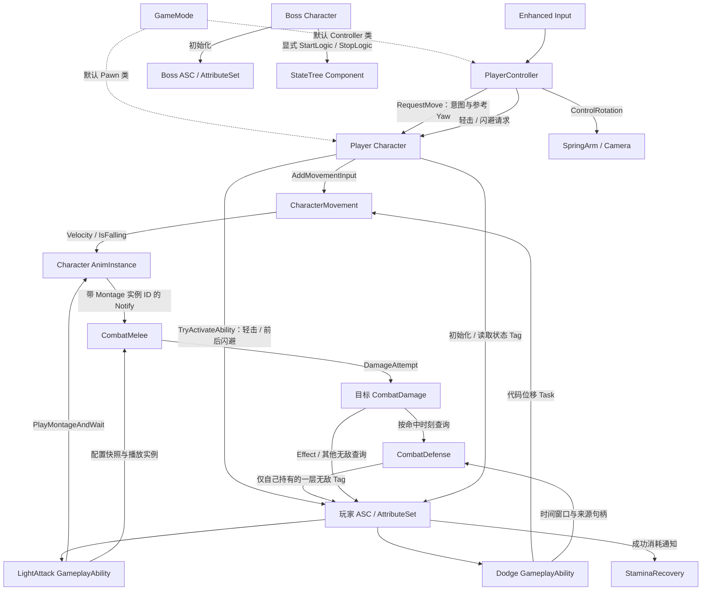
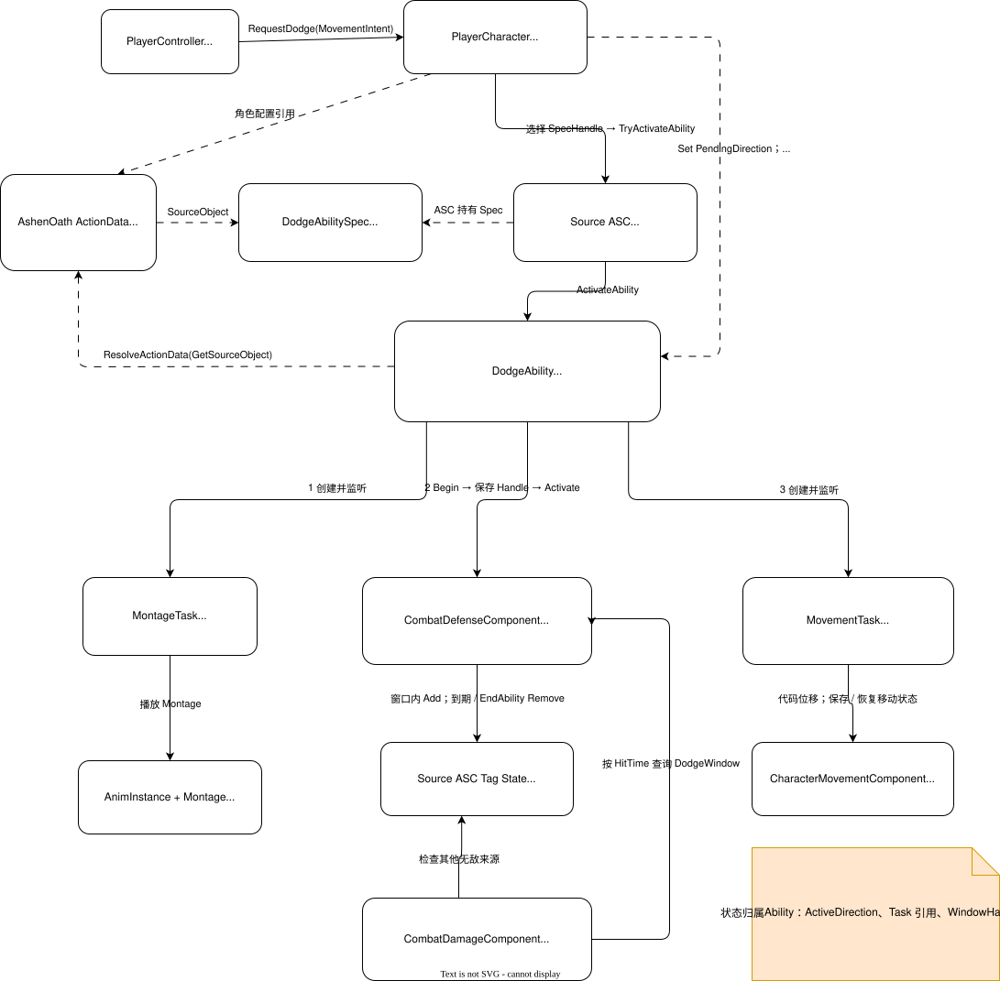

# AshenOath 架构总览

AshenOath 是单人第三人称 Boss 战项目。`AshenOath` 游戏模块组装输入、角色、GAS 和 UI；`AshenOathCombat` 提供不依赖具体玩家/Boss 类型的动作、近战扫掠与目标侧伤害组件。

## 当前结构

虚线表示默认类配置，实线表示运行时调用或数据传递；对象所有权见下表。

| 对象 | 持有或管理的内容 | 边界 |
|---|---|---|
| GameMode | 默认 Pawn/Controller 类选择 | 原生类提供默认值，蓝图子类配置资源；当前无局内流程协调 |
| PlayerController | 自身 InputComponent 的绑定、本地 Mapping Context 注册记录、最近移动意图 | 每次输入取当前 Pawn；只把闪避意图交给 Character，不实现位移积分或修改属性 |
| Player Character | ASC、AttributeSet、镜头和 Combat 组件；使用继承的 CharacterMovement | 验证角色状态、选择玩家动作数据，将相对视角意图转为世界方向；不直接写战斗数值 |
| Boss Character | ASC、AttributeSet、StateTreeComponent | 协调初始化和退出顺序；尚不承担实际选招 |
| AttributeSet | Health、MaxHealth、Stamina、MaxStamina | 维护数值范围；Health 归零目前不会自动生成死亡状态 |
| Combat GameplayAbility 基类 | 动作互斥、ActionData Cost 检查/应用与成功消耗通知 | 只共享 GAS 事务，不编排具体攻击或闪避 |
| LightAttack GameplayAbility | 一次轻击的激活互斥、Montage Task、Cost 提交及 Melee 会话协调 | Montage 启动后才提交费用；结束、中断、失败统一经 `EndAbility` 释放会话 |
| Dodge GameplayAbility | 一次闪避的方向快照、Montage、Cost、位移 Task 与 Defense 窗口协调 | 前后配置由两个 AbilitySpec 的 SourceObject 区分；玩法状态只在费用成功后建立 |
| CombatMovement AbilityTask | 一次代码位移的时间进度、MovementMode 与 RootMotionMode 接管 | Sweep 受阻自然截断；完成、取消和失败均恢复接管状态 |
| CombatDefense | 闪避窗口的世界时间、来源句柄和自己施加的 loose Tag | 不拥有 Ability；Damage 只通过它区分闪避无敌与其他无敌 |
| StaminaRecovery | 延迟计时器及自己施加的周期恢复 Effect | 跨越多次动作；只有成功消耗重启，死亡和退出停止 |
| CombatMelee | 伤害配置快照、播放来源身份、武器扫掠、Notify 窗口和窗口内去重 | 不查找当前 Ability；只接受所属 Mesh、AnimInstance、Montage 实例的信号并提交中立伤害尝试 |
| CombatDamage | 目标侧伤害入口和无敌判定 | 区分闪避无敌与其他无敌，通过源/目标 ASC 应用伤害 Effect |
| AnimInstance | 本实例的移动表现数据；对 Character/Movement 的弱引用缓存 | 读取实际移动结果，不拥有 Gameplay 动作状态 |

角色组件由构造函数创建。ASC 和 AttributeSet 随 Character 存续；动画缓存与输入注册记录使用弱引用，不延长所引用对象的生命周期。

## 两条关键运行路径

**移动到动画**：Move Input → Controller 转发意图与参考 Yaw → Character 验证约束并转换方向 → CharacterMovement 执行移动 → AnimInstance 读取实际速度。

**轻击到伤害**：Attack Input → Character 请求已授予的轻击 Ability → Montage Task 确认播放 → Melee 保存配置与播放实例快照 → GAS 提交一次 Cost → Notify 携带 Montage 实例 ID 开窗/扫掠 → 目标 CombatDamage 经 GAS 应用伤害。任何失败或中断先释放 Melee 会话，再由 Task 停止 Montage。

**闪避到清理**：Dodge Input → Character 选择前/后 AbilitySpec 并冻结世界方向 → Dodge Ability 启动 Montage → 提交一次 Cost → Defense 建立窗口、Movement Task 执行 Sweep 位移 → `EndAbility` 释放 Defense，GAS 销毁 Task 并恢复移动/根位移模式。成功消耗独立通知 StaminaRecovery 重启延迟；拒绝请求不影响已有恢复。详见 [战斗动作与伤害](systems/combat-actions.md)。

**初始化到退出**：玩家随占有刷新 GAS 上下文；Boss 在进入游戏时初始化 GAS，再调用 StateTree 启动。Boss 退出先停树，再清理 GAS 上下文，使树的退出逻辑仍可使用 GAS。

## 详细运行时架构图

