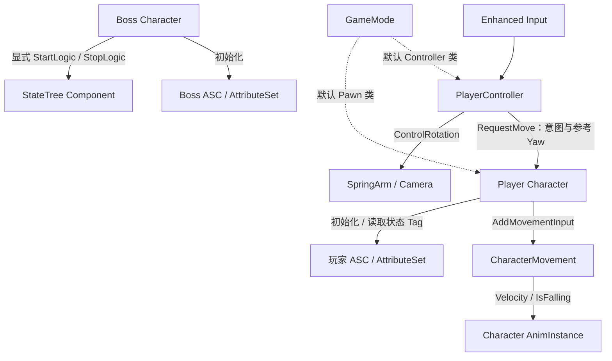

# AshenOath 架构总览

AshenOath 是单人第三人称 Boss 战项目。当前基础由一个游戏模块承载：Controller 接收输入，Character/CharacterMovement 执行移动，GAS 保存属性，AnimInstance 提供移动表现数据。

## 当前结构

虚线表示默认类配置，实线表示运行时调用或数据传递；对象所有权见下表。

| 对象 | 持有或管理的内容 | 边界 |
|---|---|---|
| GameMode | 默认 Pawn/Controller 类选择 | 原生类提供默认值，蓝图子类配置资源；当前无局内流程协调 |
| PlayerController | 自身 InputComponent 的绑定、本地 Mapping Context 注册记录 | 每次输入取当前 Pawn；不实现位移积分，不修改属性 |
| Player Character | ASC、AttributeSet、SpringArm、Camera；使用继承的 CharacterMovement | 验证角色移动约束，将相对视角意图转为世界方向 |
| Boss Character | ASC、AttributeSet、StateTreeComponent | 协调初始化和退出顺序；尚不承担实际选招 |
| AttributeSet | Health、MaxHealth、Stamina、MaxStamina | 维护数值范围；Health 归零目前不会自动生成死亡状态 |
| AnimInstance | 本实例的移动表现数据；对 Character/Movement 的弱引用缓存 | 读取实际移动结果，不拥有 Gameplay 动作状态 |

角色组件由构造函数创建。ASC 和 AttributeSet 随 Character 存续；动画缓存与输入注册记录使用弱引用，不延长所引用对象的生命周期。

## 两条关键运行路径

**移动到动画**：Input Action → Controller 转发意图与参考 Yaw → Character 验证约束并转换方向 → CharacterMovement 执行移动 → AnimInstance 读取实际速度。

**初始化到退出**：玩家随占有刷新 GAS 上下文；Boss 在进入游戏时初始化 GAS，再调用 StateTree 启动。Boss 退出先停树，再清理 GAS 上下文，使树的退出逻辑仍可使用 GAS。
